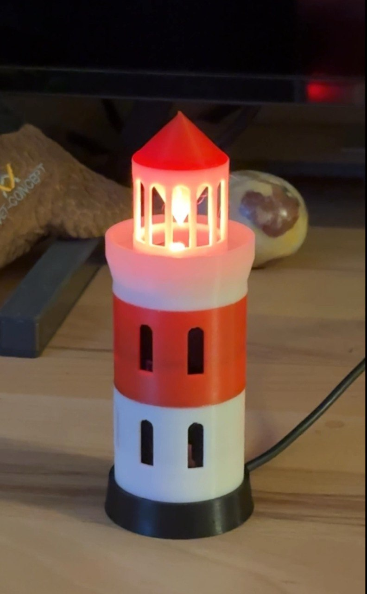
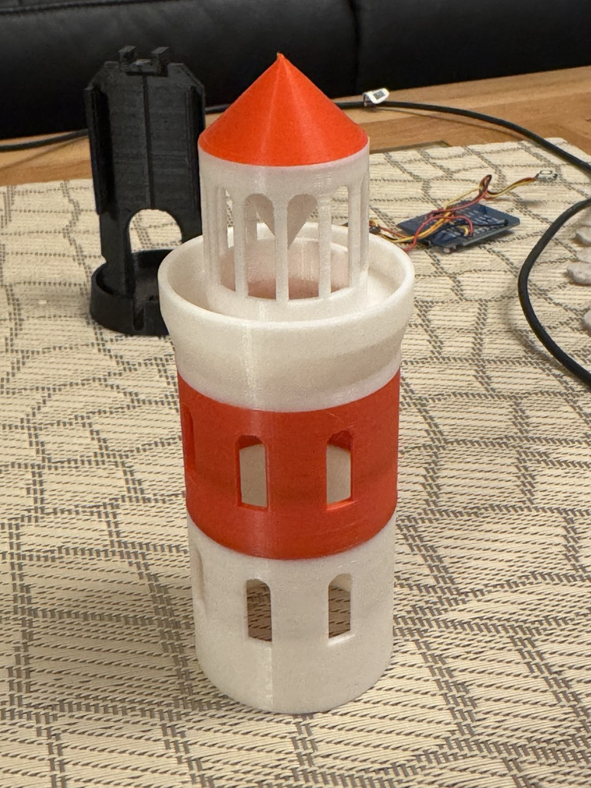
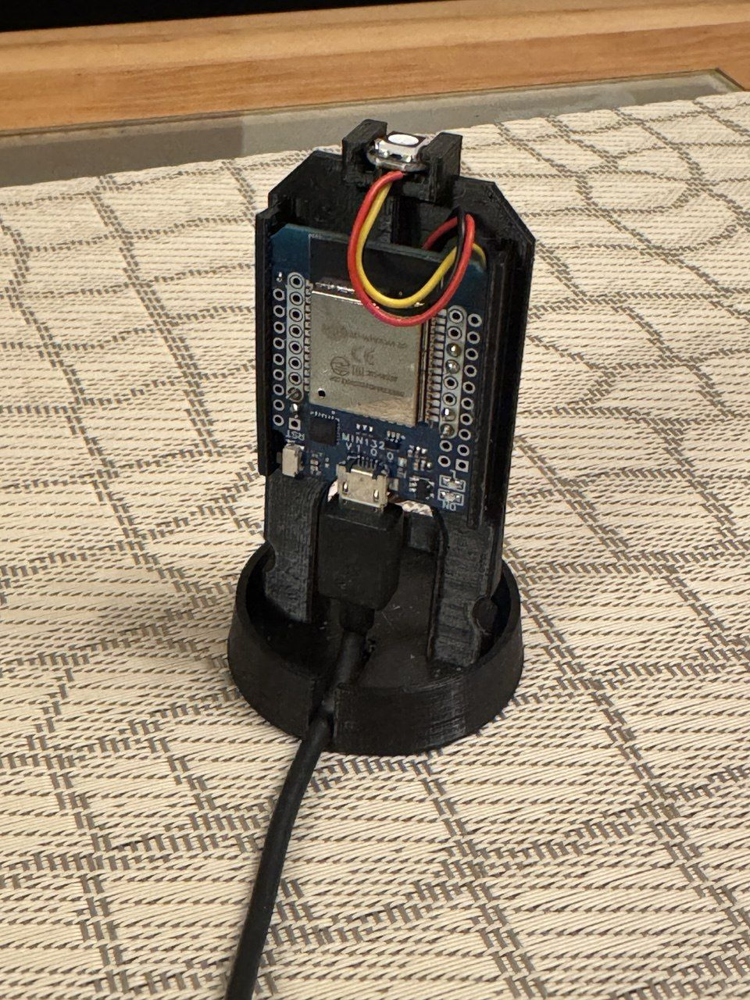
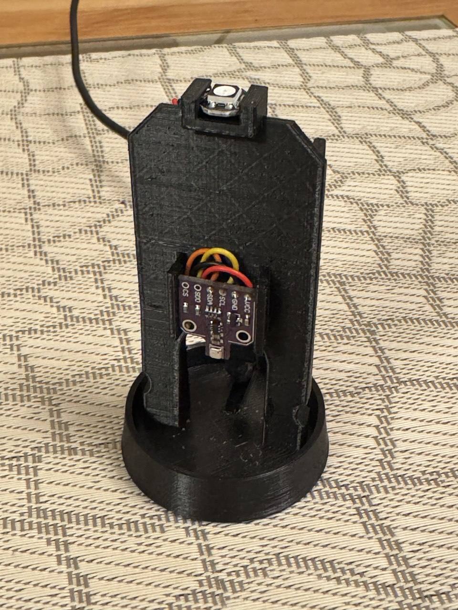
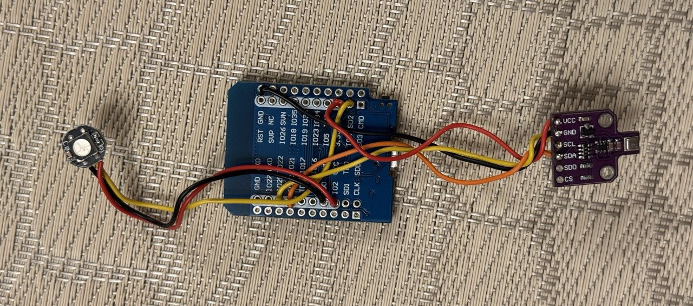
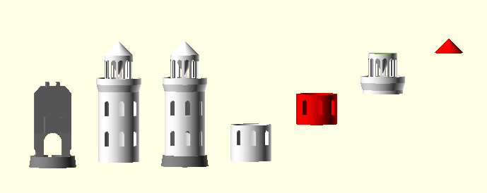
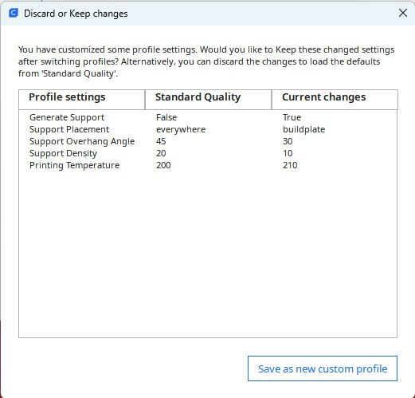

# Air-Quality-Lighthouse
Implementation of an indoor air quality monitor based on [ESPhome](https://esphome.io/) and built inside of a lighthouse model.



## Summary

The idea came from https://www.thingiverse.com/thing:5652921 where the ESP module's heat creates a chimney effect inside of the lighthouse model ensuring the air quality sensor always gets the air from outside of the housing.

This project provides the similar functionality: 
- visualizing of the air quality over the RGB LED light in the traffic light manner: from green over yellow to the flashing red 
- sending of the detailed air and environmental information to the home automation server

Instead of the direct coding in C/C++ it uses the ESPhome environment and "just sticks" the parts already implemented there together.

The lighthouse model is designed in OpenSCAD and is parametrizable so that it possible to use different ESP, Air Sensor and LED modules.

### Gallery

| | | |
| ----------- | ----------- | ----------- |
|  |  |  | 

## Circuit
 


Parts:
- ESP32 D1 Mini
- BME680 Sensor
- WS2812b RGB LED

## Model

The model is designed using OpenSCAD.
The [source file](model/Lighthouse.scad) contains multiple commented configuration parameters, so it is possible to change the design according to your needs.



Parts:
- Base with the wall carrying the electronic boards
- Shell (walls, windows, lantern, roof)

The lantern is designed as an up side down cone with the idea to reflect the light from the LED under it spreading it in all directions.

The holders for ESP and Sensor are implemented as click in place.

The holder for the LED is implemented as a slide in place.

The big hole in the wall is for the wiring between the sensor and the ESP but also for the chimney effect.

The wall divides the inside of the lighthouse in 2 rooms: the air sensor room and the ESP room.
Only the sensor room has windows. So the chimney effect from the ESP soughs the air from the sensor room over the "chimney" hole which results the soughing of the outside air over the windows into the sensor room.

There is a lock mechanism between the base and the shell consists of the circular tongue on the inner wall of the shell and the grooves on the vertical wall of the base. The tongue has 2 symmetrical interruptions so the base can slide into the shell. Then the lock is activated by twisting the shell so the tongue come inside of the groove.

## 3D Printing

The corresponding STL files are in the `model` subdirectory.

The shell can be printed as one piece or as 4 pieces (ground/firs/second floor and the roof) for the different colorization.

For the printing of the piece with the lantern you will need to activate support.
Here is my config for the Ultimaker Cura:



## Code

The code is an [ESPhome](https://esphome.io/) configuration defined in an [yaml file](code/esphome.yaml).

You can open the [yaml file](code/esphome.yaml) in any editor and analyze what is doing by searching for the keywords on the [ESPhome website](https://esphome.io/).

### Compiling and installing the code

- install ESPhome environment as described in the [installation manual](https://esphome.io/guides/installing_esphome.html), or use [uv](https://docs.astral.sh/uv/) which needs no installation at all
- rename the [secrets.yaml_emplate](code/secrets.yaml_template) into `secrets.yaml` and fill the values
- connect the ESP to the PC using the USB cable
- open the command line window in the `code` subdirectory
- execute `uvx esphome -s esphome_name <your-name-for-the-device> run .\esphome.yaml` (or `esphome` instead of `uvx esphome` if you installed it)
- run the command in a **PowerShell or cmd** window (the one in VS Code is fine); if you prefer Git Bash, see [Shell notes](#shell-notes)
- the first build downloads the ESP32 toolchain (~1-2 GB) once; later builds are fast
- the esphome tool will compile and upload the code to the ESP
- the esphome will not exit but rather executes the code on the ESP and spool its log output 
- analyze the log output for possible issue
- after that it is safe do disconnect the ESP from the PC and power it from a USB power supply
- the code is now on the ESP and will be automatically started every time you power the ESP

#### Shell notes

Use **PowerShell or cmd** (also the one in VS Code). In Git Bash (MSys) the ESP32 toolchain aborts with
`ERROR: MSys/Mingw is not supported`, because of the `MSYSTEM` variable - Git Bash re-injects it into every
child process, so `env -u MSYSTEM` cannot help. Deleting it natively is inherited by everything below, so:

```bash
powershell -c 'del env:MSYSTEM; uvx esphome -s esphome_name <your-name-for-the-device> run esphome.yaml'
```

Add `-nop` after `powershell` if your PowerShell profile interferes. ESP8266 configs are unaffected.

### Temperature offset

That chimney effect does not keep the sensor on ambient air in practice: the reading stays about **3 °C too
high** (placing the ESP32 higher than the sensor did not change it), so the residual is compensated in
[esphome.yaml](code/esphome.yaml) with:

```yaml
bme68x_bsec2_i2c:
  temperature_offset: 3
```

- BSEC **subtracts** the value: `T_out = T_raw - f(heating, supply voltage) - temperature_offset`.
  So `3` reports 3 °C less; a negative value reports more.
- It also corrects the heat compensated relative humidity (a plain sensor filter would not).
- It is compiled into the firmware - changing it needs a recompile and flash. Check `supply_voltage` first,
  no offset can fix a wrong value there.

To find the value: run the device beside a reference thermometer (LED in its normal state, settled) and
compare averages, not single samples.

