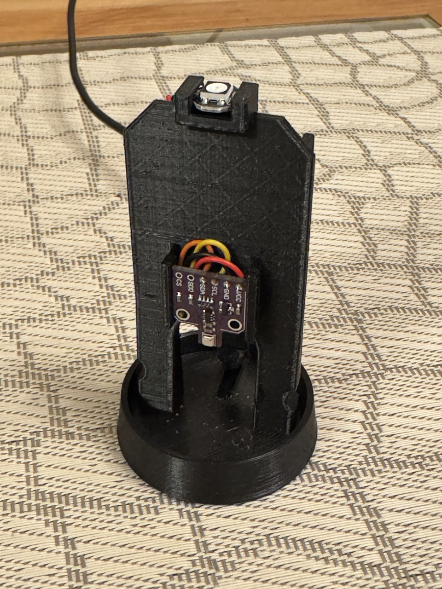

# Air-Quality-Lighthouse
Implementation of an indoor air quality monitor based on [ESPhome](https://esphome.io/) and built inside of a lighthouse model.

## Summary

The idea came from https://www.thingiverse.com/thing:5652921 where the ESP module's heat creates a chimney effect inside of the lighthouse model ensuring the air quality sensor always gets the air from outside of the housing.

This project provides the similar functionality: 
- direct displaying of the air quality over the lighthouse LED light in the traffic light manner: from green over yellow to the flashing red 
- sending of the detailed air and environmental information to the home automation server

Instead of the direct coding in C/C++ it uses the ESPhome environment and "just sticks" the parts already implemented there together.

The lighthouse model is designed in OpenSCAD and is parametrizable so that it possible to use different ESP, Air Sensor and LED modules.

## Circuit
 

Parts:
- ESP32 D1 Mini
- BME680 Sensor
- WS2812b RGB LED

## Model

The model is designed using OpenSCAD.
The [source file](model/Lighthouse.scad) contains multiple commented configuration parameters, so it is possible to change the design according to your needs.

Parts:
- Base with the wall carrying the electronic boards
- Shell (walls, windows, lantern, roof)

The lantern is designed as an up side down cone with the idea to reflect the light from the LED under it spreading it in all directions.

The holders for ESP and Sensor are implemented as click in place.

The holder for the LED is implemented as a slide in place.

The big hole in the wall is for the wiring between the sensor and the ESP but also for the chimney effect.

The wall divides the inside of the lighthouse in 2 rooms: the air sensor room and the ESP room.
Only the sensor room has windows. So the chimney effect from the ESP soughs the air from the sensor room over the "chimney" hole which results the soughing of the outside air over the windows into the sensor room.

There is a lock mechanism between the base and the shell consists of the circular tongue on the inner wall of the shell and the grooves on the vertical wall of the base. The tongue has 2 symmetrical interruptions so the base can slide into the shell. Then the lock is activated by twisting the shell so the tongue come inside of the groove.

### Gallery

| | | |
| ----------- | ----------- | ----------- |
|  |  |  | 

### 3D Printing

The corresponding STL files are in the `model` subdirectory.

The shell can be printed as one piece or as 4 pieces (ground/firs/second floor and the roof) for the different colorization.

For the printing of the piece with the lantern you will need to activate support.
Here is my config for the Ultimaker Cura:

## Code

TODO...

- [ESPHome definition of the Air Quality notification](code/esphome.yaml)

howto run esphome: `esphome -s esphome_name <your-name-for-the-device> run .\esphome.yaml`
